# mobile-app-dev-s2-21-project-Bricode
mobile-app-dev-s2-21-project-Bricode created by GitHub Classroom

Gist: https://gist.github.com/Bricode/861979e91b4c2ef909c078370a9516da
mock up: https://app.moqups.com/FcJ9vLIbys/view/page/ae8fe8eb0

**User Guide:**
When the app is first opened, you will see a loading screen  
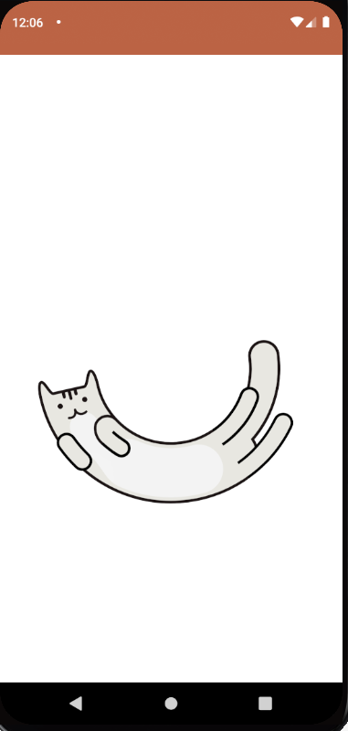  
Once the app has loaded, you will be on a login page  
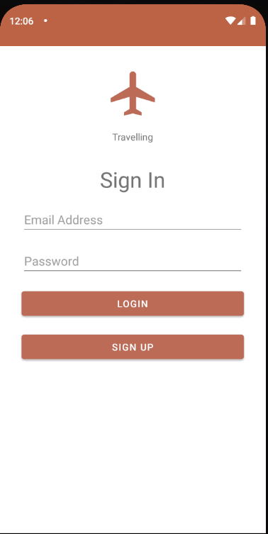  
This allows you to redirect to the sign up page to create an account, or sign into an existing account.  
If you need to make a new account, click the sign up button  
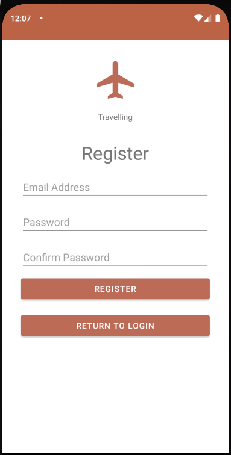  
This page lets you register a new account in the system.  
Once you have made an account and then signed in using those details, you will be directed to the country selection page.  
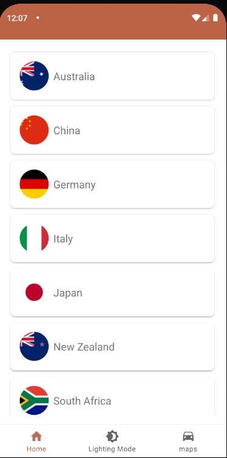  
This screen presents you with a number of countrys to select from as well as the bottom navigation bar, which can take you to the lighting mode selection screen or the map to explore different tourist destinations  
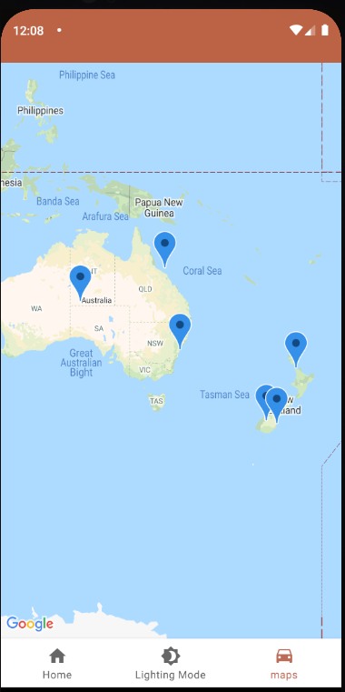  
if you select a country, for example Australia, you will be taken to the next page.  
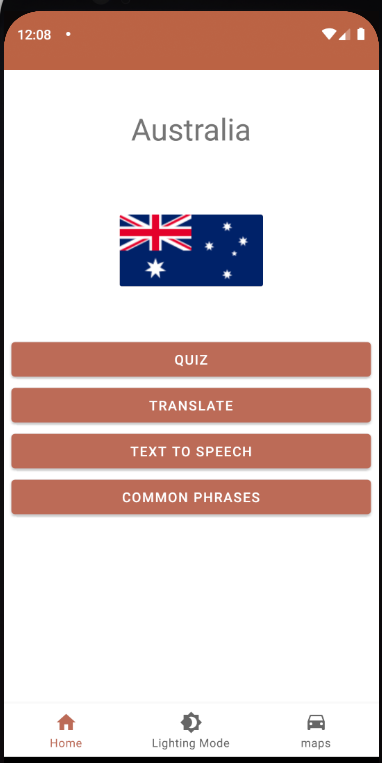  
This page has a number of options to select from.  
You can take a quiz about the country and view your scores once you finish  
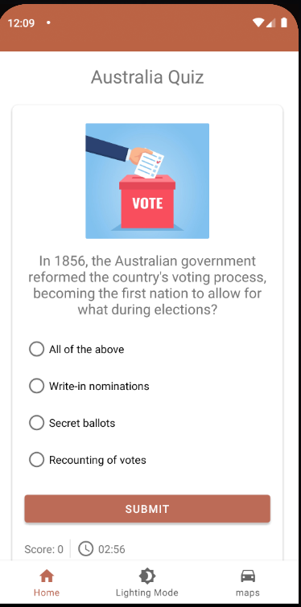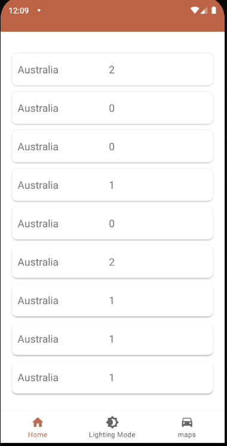  
You can translate text into that countries native language  
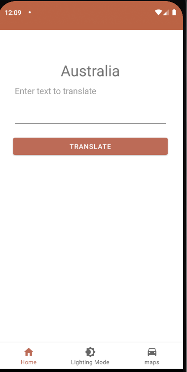  
You can turn text into speech on this screen  
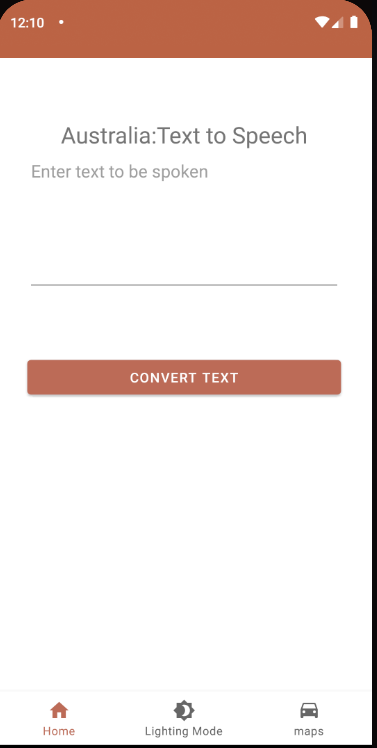  
The last option is to view common phrases from that country  
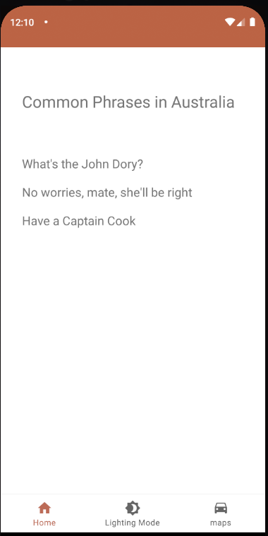  

That is all the functionality of this app, hope you enjoy  
